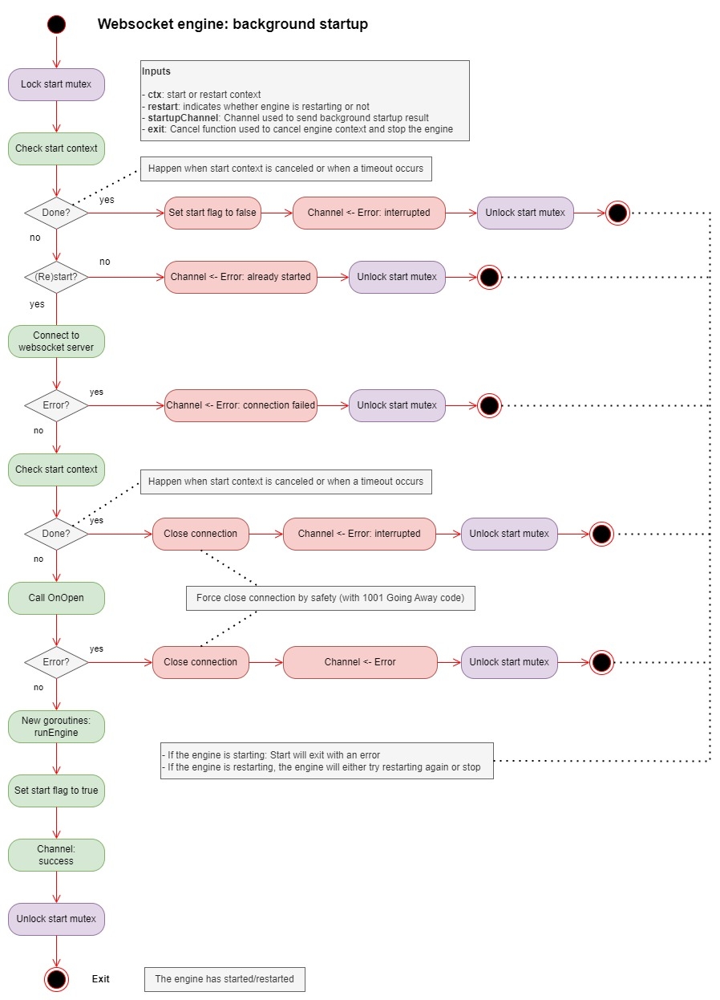
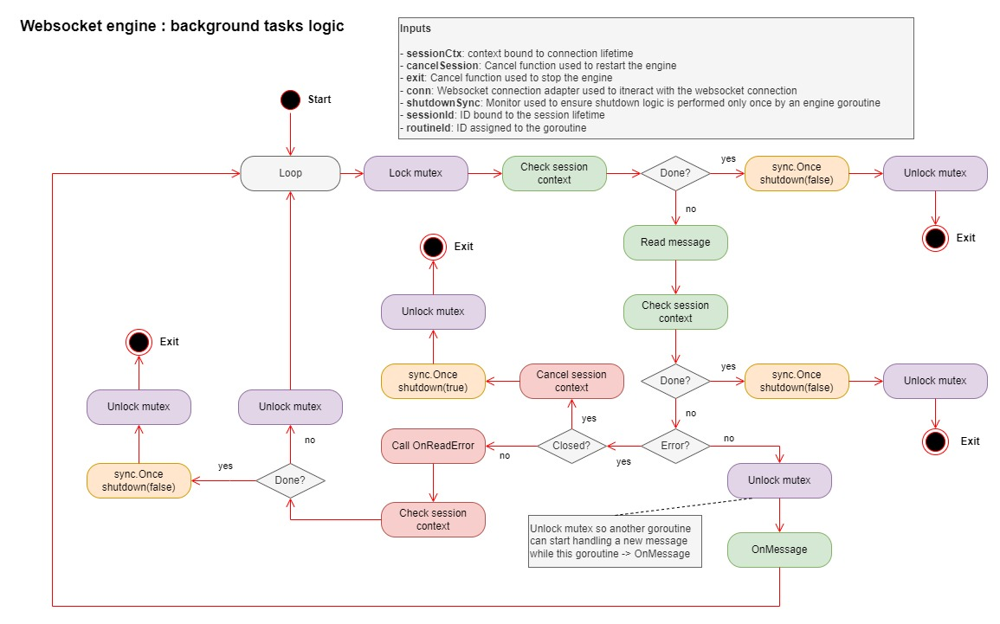
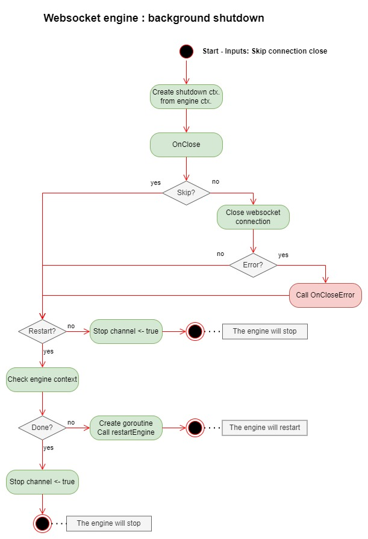
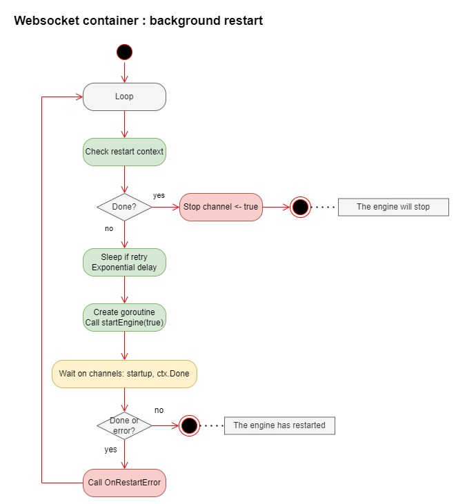
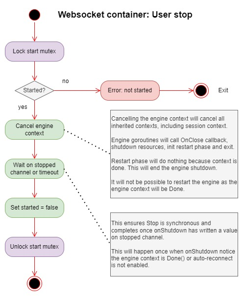

# Websocket client engine operations

The purpose of this chapter is to provide users with clear documentation of how the engine works, how it processes messages, and how it invokes user-provided callbacks.

Engine operations are divided into 6 main functions:
- **Engine start** - What the engine does when the Start method is called
- **Engine internal start** - What the engine does when it starts or restarts
- **Engine run** - What the engine does when it is running and processing messages from the websocket server.
- **Engine shutdown** - What the engine does when the engine stops (connection broken, Stop method called, exit/restart functions called or root context aborted)
- **Engine restart** - What the engine does when it restarts after being stopped.
- **Engine stop** - What the engine does when the Stop method is called

## Engine start

The engine starts when the Start method is called by the user. The Start method creates a goroutine that performs the engine internal start and waits for a signal from that goroutine to know when the engine has finished starting. The method returns when the engine has finished starting, e.g. when the engine internal goroutine has opened a connection to the websocket server, called OnOpen callback and created goroutines that will read and process messages from the server.

## Engine internal start

The startEngine private method is called when the engine is started or restarted. This method will open a connection to the websocket server, call the OnOpen callback, create goroutines to process messages, and send a signal to indicate whether or not the engine has started successfully.

## Engine run

The runEngine private method is the logic performed by all engine goroutines to process messages from the websocket server.

Each goroutine first locks the read mutex and then reads a message from the websocket server. When a message is received, the goroutine will unlock the mutex and then process the message by calling the OnMessage callback. This is done so that other engine goroutines can continue processing messages while the goroutine is busy processing the current message.

In the event of an error, the goroutine still holding the read mutex will determine the cause of the error. If the connection has been broken, the goroutine shut down the engine to either restart or stop the engine. If the error is not caused by the connection being closed, the goroutine will call OnReadError callback. Then, if the engine needs to be restarted or stopped, the goroutine will create a new shut down the engine. Otherwise, the goroutine will release the read mutex and exit the loop.

## Engine shutdown

The shutdown private method is called once by one of the engine goroutines when the engine is told to restart or stop, to close the websocket connection and restart the engine if necessary.

The goroutine will first call the OnClose callback. Then, if necessary, the goroutine will close the websocket connection. If the engine needs to be restarted, the goroutine will create a new goroutine that will call the restartEngine private method to restart the engine. The current goroutine will return from shutdown, release the read mutex (and let other engine goroutines exit), and exit.

## Engine restart

The restartEngine private method is called by a separate goroutine created by the shutdown private method. The internal method restart will continuously try to restart the engine until it succeeds or is interrupted.

The goroutine will continuously create new goroutines that will call startEngine until either the engine has been restarted or the user decides to interrupt the engine in its restart loop.

## Engine stop

The Stop method is called by the user to stop the engine. The method returns when a stop signal is received from the engine or a timeout occurs.

